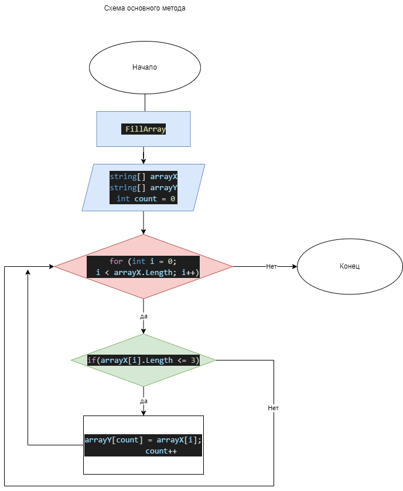

# Final work

## Задача: 

Написать программу, формирующую массив строк из существующего массива строк, длина которого меньше или равна 3 символам.  Исходный массив можно ввести с клавиатуры, либо задать в начале алгоритма.  
* Рекомендации:
При решении не рекомендуется использовать коллекции, лучше использовать только массивы

## Решение.
Объявляется первый массив строк "array1" определённой длины заполненный текстом произвольной длины. Далее методом "Array2Length" определяем длину для второго массива "array2" и объявляем его. Методом "FillArray" определяем элементы массива 1 длиной 3 менее символа и копируем их во второй массив. Метод "PrintArray" выводит полученный результат из второго массива в окно терминала. 

